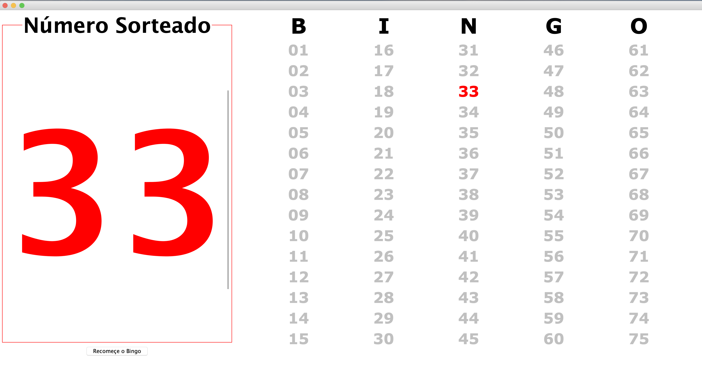
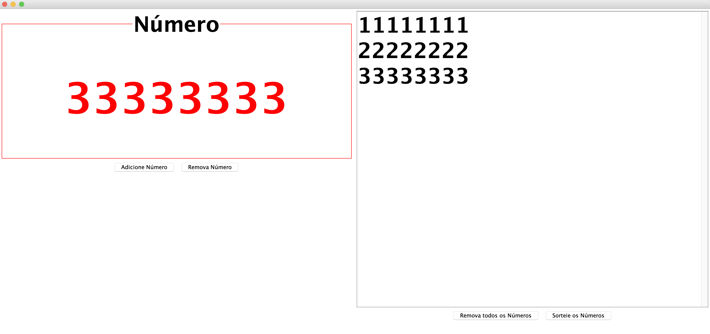

## :8ball: Como usar o Bingo do ICT

- Faça download do arquivo neste [link](https://github.com/pmunizferreira/ict/tree/develop/Bingo)
- Clique no arquivo para abrir a janela do Bingo

- Para adicionar um número sorteado, digite na caixa de texto à esquerda e clique ENTER.
- Para reiniciar o bingo, clique no botão `Recomeçe o Bingo`.

- :pushpin: **Atenção**: Se a janela for fechada, os números do Bingo se perderão.

## :gift_heart: Como usar o Sorteio de Prêmios do ICT

- Faça download do arquivo neste [link](https://github.com/pmunizferreira/ict/tree/develop/Sorteio)
- Clique no arquivo para abrir a janela do Sorteio de Prêmios

- Para adicionar um número para sorteio, digite na caixa de texto à esquerda e clique ENTER ou no botão `Adicione Número`.
- Para remover um número do sorteio, digite na caixa de texto à esquerda e clique no botão `Remova Número`.
- Para limpar todos os números do sorteio, clique no botão `Remova todos os Números`.
- Para sortear um número, clique no botão `Sorteie os Números`. O sorteio apenas será feito se existirem pelo menos 2 números.

- :pushpin: **Atenção**: Mesmo que janela seja fechada, os números do Sorteio se manterão no arquivo `sorteio_ICT.txt`. Se desejar abrir o mesmo sorteio em outro computador, não esqueça de copiar este arquivo.

- :pushpin: **Atenção**: Evite abrir o arquivo `sorteio_ICT.txt` enquanto a janela do Sorteio estiver aberta.
